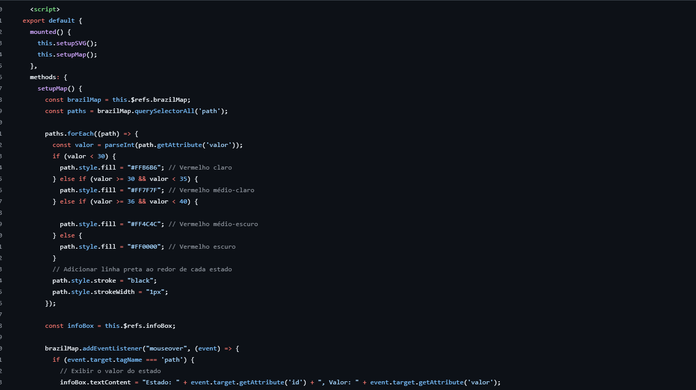
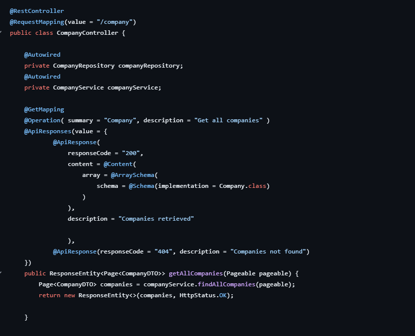
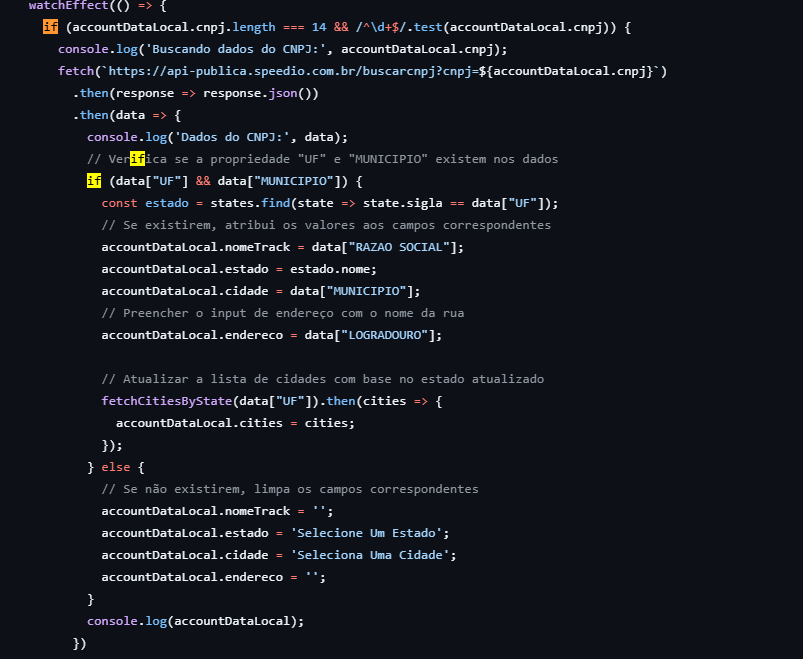

<h2>Sobre mim</h2>

Comecei minha carreira trabalhando com gestão de tráfego de dados, onde percebi o quanto a automação pode facilitar a organização e análise de informações. Isso despertou meu interesse pela programação, especialmente Python, que me mostrou as diversas oportunidades que esse campo oferece.

Em 2022, dei um grande passo ao iniciar o curso de Banco de Dados na FATEC. Desde então, venho melhorando minhas habilidades em desenvolvimento de backend e administração de bancos de dados.

Tenho experiência na construção de projetos web usando Java (SpringBoot) e JavaScript (Node.js, React.js, Typescript), sempre priorizando a experiência do usuário e buscando melhorar a performance e a qualidade do código.

Já trabalhei em empresa como APTIV, uma empresa do segmento automotivo, onde pude trabalhar em um laboratório de engenharia. Minha função envolvia o uso de Python para automatizar máquinas, realizar testes de equipamentos e registrar informações.

Além disso, também trabalho em outra empresa, onde utilizo desde ferramentas de low code até a codificação direta no desenvolvimento de demandas de produtos personalizados para empresas que entram em contato conosco.

## Contatos
* [Git](https://github.com/laroyprado)
* [LinkedIn](https://www.linkedin.com/in/laroyprado)

## Meus Principais Conhecimentos

**Aplicações e dados**

## Meus Projetos

### Em 2022-2

### Empresa Parceira: [Avaliação 360° (Projeto Interno)]()

### Problema:
O problema do projeto era criar um sistema de avaliação democratizada para a empresa PBLTeX, onde os membros do time pudessem se avaliar, incluindo autoavaliação, e ainda ter avaliações extras feitas por líderes e pelo cliente. Precisava ter controle de usuários, times, sprints e mostrar tudo isso em dashboards. O desafio era juntar tudo isso num sistema fácil de usar e que atendesse todos esses requisitos.

### Solução Entregue pela Equipe:

A equipe desenvolveu uma aplicação que permitia aos integrantes do time realizar avaliações 360º, onde cada um podia avaliar os colegas e a si mesmo. Além disso, foram implementadas avaliações extras feitas pelo líder do grupo e pelo cliente. O sistema tinha controle de usuários e perfis, organizava as avaliações por sprints e mostrava tudo em dashboards, facilitando o acompanhamento dos resultados. Usamos ferramentas como GitHub, Notion e Excel para gerenciar e armazenar os dados, e criamos o front e back-end da aplicação, seguindo o planejamento das sprints.

[Repositório do Projeto ](https://github.com/laroyprado/Projeto-API-Equipe-First)

#### Tecnologias Utilizadas
> - **Python**: Utilizado no desenvolvimento do backend, proporcionando flexibilidade e facilidade de manutenção na lógica do sistema.
> - **PySimpleGUI**: Ferramenta utilizada para o desenvolvimento da interface gráfica do usuário, permitindo uma criação rápida e simples da UI.
> - **Figma**: Utilizado para design e prototipagem da interface, ajudando no planejamento do layout da aplicação.
> - **Excel**: Utilizado para armazenar e gerenciar os dados do projeto de forma simples e eficaz.
> - **Git e GitHub**: Essenciais para controle de versão e colaboração entre os membros da equipe, garantindo o gerenciamento eficiente do código.
> - **Notion**: Ferramenta usada para gerenciar as tarefas do projeto e organizar o fluxo de trabalho da equipe.

#### Contribuições Pessoais

  
Atuei como Scrum Master

    Esse código cria uma interface gráfica simples para uma tela de login usando a biblioteca PySimpleGUI.
    Define o tema visual da interface (LightGreen1) para determinar as cores e o estilo.
    É montada uma estrutura que organiza os elementos visuais, como caixas de texto, campos de entrada, um botão, e uma opção para salvar o login.

  
Configuração da interface da tela de login

    
    Esse código cria uma interface gráfica simples para uma tela de login usando a biblioteca PySimpleGUI.
    Define o tema visual da interface (LightGreen1) para determinar as cores e o estilo.
    É montada uma estrutura que organiza os elementos visuais, como caixas de texto, campos de entrada, um botão, e uma opção para salvar o login.

  
Configuração da lógica da tela de login

    
    Esse código adiciona a lógica funcional à interface de login criada no tópico anterior. Ele fica em um loop contínuo, aguardando interações do usuário com a janela.

#### Hard Skills

- **Python** : Sei fazer com autonomia
- **Notion** : Sei fazer com autonomia

#### Soft Skills

**Comunicação**: Exercitei minhas habilidades de comunicação ao interagir frequentemente com a equipe, transmitindo a visão do cliente e alinhando expectativas. Mantive um diálogo aberto e constante com o cliente para entender suas necessidades e garantir que as funcionalidades desenvolvidas atendessem às suas expectativas.

**Autodidatismo** : Demonstrei proatividade ao buscar e adquirir conhecimentos sobre tecnologias novas, como Spring Boot, que não tinha familiaridade anteriormente. 

**Trabalho sob pressão**: Em momentos de baixa de recursos no time, assumi mais responsabilidades do que o habitual para garantir que o projeto fosse entregue dentro do prazo estabelecido. 

### Em 2023-1

## Projeto de Desenvolvimento de Sistema de Gestão de Horas Extras e Sobreavisos

### Empresa Parceira: [2RP](https://2rpnet.com.br/)

### Problema:
A empresa enfrentava dificuldades na gestão eficiente das horas extras e sobreavisos dos colaboradores. O processo manual de registro e aprovação dessas horas era moroso e propenso a erros, resultando em atrasos no pagamento e insatisfação dos funcionários. Além disso, não havia um sistema centralizado para acompanhar e analisar essas informações, dificultando a tomada de decisões estratégicas por parte da gestão.

### Solução Entregue pela Equipe:
Nossa equipe desenvolveu um sistema de gestão de horas extras e sobreavisos sob medida para as necessidades da empresa. O sistema permite que os colaboradores e gestores registrem e acompanhem suas horas extras e sobreavisos de forma intuitiva e eficiente. Os administradores têm acesso a ferramentas avançadas de parametrização, que permitem padronizar o sistema com valores a serem pagos pelas horas extras.

O sistema também automatiza o processo de aprovação, encaminhando as horas registradas para os gestores e administradores responsáveis, agilizando assim o pagamento e garantindo a conformidade com as políticas internas da empresa. Com uma interface amigável e recursos de relatórios integrados, o sistema oferece uma visão abrangente e em tempo real das horas trabalhadas, facilitando a análise e a tomada de decisões pelos gestores.

[Repositório do Projeto ](https://github.com/codecatss/API-BD3)

#### Tecnologias Utilizadas
>

> - **Java**: Essencial para o desenvolvimento do backend do sistema de gestão de horas extras e sobreavisos.
> - **JavaFX**: Essencial para o desenvolvimento do Frontend de forma criativa e componentizada
> - **Git e Github**: Ferramentas essenciais para controle de versão e colaboração entre os membros da equipe, permitindo o gerenciamento eficiente do código-fonte.
> - **MySQL**: Ferramentas essenciais para controle de versão e colaboração entre os membros da equipe, permitindo o gerenciamento eficiente do código-fonte.

#### Contribuições Pessoais

  
Utilização do componente combobox do JavaFX

    
Esse método é responsável por configurar a interação do ComboBox que controla os filtros de uma tabela. Quando a interface é carregada, ele preenche o ComboBox com quatro opções: "TODAS HORAS", "REPROVADAS", "APROVADAS" e "PENDENTES", e define "TODAS HORAS" como padrão.

A ideia é que, quando o usuário escolhe uma dessas opções, o código detecta essa mudança e executa ações específicas. Por exemplo, se a pessoa selecionar "APROVADAS", o sistema carrega apenas as horas aprovadas na tabela. O método que faz essa atualização é o carregarTabelaLancamento, que é chamado em todas as situações. Assim, independentemente do filtro escolhido, a tabela é sempre atualizada.

  
Validação e Registro de Reprovação com Justificativa em JavaFX

    
O método assegura que o processo de reprovação seja realizado de forma válida e organizada. Ele exige que o usuário selecione um item na tabela e forneça uma justificativa antes de registrar a reprovação. Caso a justificativa esteja ausente, um aviso é exibido, impedindo que a ação prossiga sem as informações necessárias. Quando todos os critérios são atendidos, a reprovação é registrada no banco de dados, a tabela de aprovação é atualizada para refletir as alterações, e o campo de justificativa é limpo para evitar reutilizações acidentais. Isso garante uma validação rigorosa, facilita a rastreabilidade das reprovações e mantém o sistema consistente e confiável.

#### Hard Skills

- **Java** : Sei fazer com autonomia
- **JavaFx** : Sei fazer com ajuda
- **Git/Github** : Sei fazer com ajuda
- **MySQL** : Sei fazer com ajuda

#### Soft Skills

**Autodidatismo** : Por ser uma nova tecnologia, tive que aprender ao decorrer do semestre como utiliza-la para ter o sucesso do projeto 

**Colaboração**
Em momentos que alguém do time estava com dificuldades ou problemas em sua task, acabei por ajudar ou realizar a task para que assim, tivesse-mos sucesso na sprint

### Em 2023-2 

## Projeto de Desenvolvimento de Sistema de Gestão de Horas Extras e Sobreavisos

### Empresa Parceira: [2RP](https://2rpnet.com.br/)

### Problema:
A empresa enfrentava dificuldades na gestão eficiente das horas extras e sobreavisos dos colaboradores. O processo manual de registro e aprovação dessas horas era moroso e propenso a erros, resultando em atrasos no pagamento e insatisfação dos funcionários. Além disso, não havia um sistema centralizado para acompanhar e analisar essas informações, dificultando a tomada de decisões estratégicas por parte da gestão.

### Solução Entregue pela Equipe:
Nossa equipe desenvolveu um sistema de gestão de horas extras e sobreavisos sob medida para as necessidades da empresa. O sistema permite que os colaboradores e gestores registrem e acompanhem suas horas extras e sobreavisos de forma intuitiva e eficiente. Os administradores têm acesso a ferramentas avançadas de parametrização, que permitem padronizar o sistema com valores a serem pagos pelas horas extras.

O sistema também automatiza o processo de aprovação, encaminhando as horas registradas para os gestores e administradores responsáveis, agilizando assim o pagamento e garantindo a conformidade com as políticas internas da empresa. Com uma interface amigável e recursos de relatórios integrados, o sistema oferece uma visão abrangente e em tempo real das horas trabalhadas, facilitando a análise e a tomada de decisões pelos gestores.

[Repositório do Projeto ](https://github.com/codecatss/API-BD3)

#### Tecnologias Utilizadas
>

> - **Java**: Essencial para o desenvolvimento do backend do sistema de gestão de horas extras e sobreavisos.
> - **Spring Boot**: Facilita a configuração e o desenvolvimento de aplicativos Java, permitindo uma rápida implementação de serviços web e RESTful.
> - **JavaScript**: Utilizado para desenvolver a lógica do lado do cliente, interatividade e dinamismo na interface do usuário.
> - **Hibernate**: Fornece uma camada de mapeamento objeto-relacional para o banco de dados, simplificando a interação com o banco de dados relacional.
> - **Docker**: Utilizado para empacotar, distribuir e executar aplicativos em contêineres, garantindo consistência e portabilidade do ambiente de desenvolvimento para produção.
> - **Git e Github**: Ferramentas essenciais para controle de versão e colaboração entre os membros da equipe, permitindo o gerenciamento eficiente do código-fonte.
> - **HTML**: Responsável pela estruturação do conteúdo da página web.
> - **CSS**: Utilizado para estilizar e formatar o layout da página web, garantindo uma experiência visual agradável para o usuário.

#### Contribuições Pessoais

  
Configuração do método GET no "/cr"

  
   
DDesenvolvi o CenterResultController para gerenciar os resultados dos centros em nossa aplicação. Este controlador REST opera sobre o protocolo HTTP, que é a base da comunicação na web, permitindo que clientes e servidores se comuniquem. No contexto REST (Representational State Transfer), que é um estilo arquitetural para sistemas distribuídos, o CenterResultController lida com requisições HTTP para salvar e recuperar informações dos centros de resultados.

Ao utilizar anotações como @RestController e @RequestMapping, defini a classe como um controlador e mapeei as requisições para o caminho "cr", tornando mais claro o acesso aos recursos relacionados aos centros de resultados.

O método saveCenterResult foi projetado para garantir que todas as informações necessárias sejam fornecidas antes de salvar um centro de resultado, o que ajuda a prevenir duplicatas e erros de dados. Enquanto isso, o método getAll é responsável por recuperar uma lista de todos os centros de resultados, facilitando a visualização e o gerenciamento desses dados.

A anotação @CrossOrigin é uma medida de segurança que permite que a API seja acessada de diferentes origens, o que é fundamental para a integração com outras partes do sistema ou aplicações de terceiros. Isso ajuda a evitar problemas de segurança, ao mesmo tempo em que possibilita uma maior flexibilidade na interação com a API.

  
Configuração Do Swagger 

  
   
 Desenvolvi a configuração do Swagger como parte do processo de criação. Essa experiência me proporcionou uma compreensão mais profunda do funcionamento das APIs RESTful e da importância da documentação precisa. O Swagger é uma ferramenta essencial para criar e visualizar a documentação de APIs de forma clara e acessível. Ele permite que desenvolvedores e usuários finais entendam facilmente os endpoints disponíveis, os parâmetros necessários e os formatos de resposta esperados. Além disso, o Swagger oferece uma interface interativa que possibilita testar as funcionalidades da API diretamente na documentação, simplificando o processo de desenvolvimento e garantindo uma melhor experiência para os usuários.

  
Configuração Do Token Service

  
   
Desenvolvi o arquivo TokenService.java, uma peça fundamental na estrutura da nossa aplicação API3SEM. Este serviço desempenha um papel central na geração e validação de tokens JWT, fortalecendo a segurança do processo de autenticação dos usuários. Por meio dele, somente usuários autenticados têm permissão para acessar funcionalidades específicas da nossa API, garantindo, assim, a proteção de dados sensíveis e a privacidade dos nossos clientes.

  
Configuração do filtro de horas

  
   
O método filtredHours que desenvolvi permite filtrar registros de horas em nossa API. Ele aceita parâmetros para identificar o tipo de filtro e a variável de busca. Dependendo do filtro, seja por gestor, matrícula, código de CR ou cliente, o método busca e retorna os registros relevantes. Se não encontrar registros ou ocorrer um erro, ele lança uma exceção com uma mensagem explicativa. Esse recurso facilita a busca de informações específicas pelos usuários.

#### Hard Skills

- **Java** : Sei fazer com autonomia
- **Springboot** : Sei fazer com autonomia
- **Javascript**: Sei Fazer com autonomia
- **Html** : Sei Fazer com autonomia
- **Css** : Sei Fazer com autonomia
- **PostgreSQL** : Sei fazer com ajuda

#### Soft Skills

**Comunicação**: Exercitei minhas habilidades de comunicação ao interagir frequentemente com a equipe, transmitindo a visão do cliente e alinhando expectativas. Mantive um diálogo aberto e constante com o cliente para entender suas necessidades e garantir que as funcionalidades desenvolvidas atendessem às suas expectativas.

**Autodidatismo** : Demonstrei proatividade ao buscar e adquirir conhecimentos sobre tecnologias novas, como Spring Boot, que não tinha familiaridade anteriormente. 

**Trabalho sob pressão**: Em momentos de baixa de recursos no time, assumi mais responsabilidades do que o habitual para garantir que o projeto fosse entregue dentro do prazo estabelecido. 

### Em 2023-2 

## Oracle Partner Tracker

### Empresa Parceira: [Oracle](https://www.oracle.com/)

### Problema:
A Oracle enfrenta dificuldades na gestão e análise eficiente dos dados provenientes do sistema OPN (Oracle PartnerNetwork) das empresas parceiras. A ausência de uma plataforma moderna compromete a visualização inteligente dessas informações, dificultando a identificação de melhorias e a tomada de decisões estratégicas.

### Solução Entregue pela Equipe:
A Oracle Partner Tracker é uma plataforma moderna e inteligente de gerenciamento e análise de dados, capaz de interpretar, organizar e representar os dados do sistema OPN da empresa parceira Oracle. Entre os objetivos principais do projeto, se encontram a modernização do acompanhamento das empresas parceiras Oracle, assim como a visualização de dados de forma inteligente, para facilitar a identificação de melhorias e de conclusões estratégicas.

[Repositório do Projeto ](https://github.com/codecatss/API-BD4)

#### Tecnologias Utilizadas
>

> - **Java**: Essencial para o desenvolvimento do backend do sistema de gestão de horas extras e sobreavisos.
> - **Spring Boot**: Facilita a configuração e o desenvolvimento de aplicativos Java, permitindo uma rápida implementação de serviços web e RESTful.
> - **Vue**: Utilizado para desenvolver a lógica do lado do cliente, interatividade e dinamismo na interface do usuário.

> - **Git e Github**: Ferramentas essenciais para controle de versão e colaboração entre os membros da equipe, permitindo o gerenciamento eficiente do código-fonte.

> - **MySQL**: Ferramentas essenciais para controle de versão e colaboração entre os membros da equipe, permitindo o gerenciamento eficiente do código-fonte.

#### Contribuições Pessoais

  
Mapa do Brasil Integrado a Imagem

  
   
Desenvolvi o componente BrazilMap.vue para exibir de forma visual e interativa os dados regionais no contexto do mapa do Brasil. Esse componente Vue opera sobre um SVG do mapa brasileiro, permitindo representar graficamente informações quantitativas para cada estado de maneira clara e acessível.

Ao utilizar o ciclo de vida mounted, o componente executa duas funções principais: setupSVG e setupMap. A função setupSVG é responsável por associar os dados estáticos (como nome do estado e valor numérico) aos elementos SVG que representam cada estado no mapa. Já a função setupMap cuida da lógica de coloração, definindo tonalidades de vermelho com base nos valores atribuídos a cada estado — quanto maior o valor, mais escura a tonalidade.

Implementei também interações com o mouse para melhorar a experiência do usuário. Ao passar o cursor sobre um estado, o componente exibe uma info-box dinâmica com detalhes do nome e valor, além de destacar visualmente o estado selecionado. Isso permite uma exploração intuitiva e responsiva do mapa.

O componente é ideal para aplicações que demandam visualização geográfica de indicadores — como dados climáticos, econômicos ou populacionais —, tornando a análise regional mais acessível e visualmente atrativa.

  
Configuração Do Controller Company

  
   
Desenvolvi o CompanyController para gerenciar as operações relacionadas às empresas em nossa aplicação. Esse controlador REST segue o padrão arquitetural RESTful, que permite que o frontend e outras aplicações se comuniquem com o backend de forma simples e padronizada através de requisições HTTP.

Utilizando anotações como @RestController e @RequestMapping com o caminho "/company", defini claramente o ponto de entrada das requisições relacionadas a empresas. Essa organização facilita a manutenção e escalabilidade do sistema, agrupando as funcionalidades por domínio.

O método getAllCompanies foi projetado para recuperar de forma paginada todas as empresas registradas no sistema. Isso garante eficiência na busca e na exibição dos dados, especialmente em cenários com um grande volume de registros. A resposta retorna um Page de CompanyDTO, promovendo uma camada de segurança e desacoplamento entre a entidade de banco e os dados expostos ao cliente.

A integração com o Swagger por meio das anotações @Operation e @ApiResponses fornece uma documentação clara e automática da API. Isso é essencial para o entendimento e consumo da API por outros desenvolvedores, além de ajudar na validação e testes.

A separação da lógica de negócios foi mantida com o uso de um serviço (CompanyService) e de um repositório (CompanyRepository), respeitando os princípios da arquitetura em camadas. Essa abordagem melhora a organização do código, facilita os testes e aumenta a coesão das responsabilidades de cada classe.

  
Função Conectada a API Externa para busca de CNPJ

  
   
Implementei esta função reativa com watchEffect para automatizar a busca e preenchimento dos dados cadastrais de uma empresa com base no CNPJ informado. Esse comportamento foi desenvolvido dentro de um componente Vue.js, utilizando o paradigma reativo para acompanhar mudanças no valor do CNPJ.

Sempre que o campo de CNPJ (accountDataLocal.cnpj) atinge 14 dígitos numéricos válidos, a função é acionada automaticamente. A partir disso, uma requisição HTTP é enviada para a API pública da Speedio, que retorna informações oficiais da Receita Federal sobre o CNPJ informado.

Com os dados recebidos, realizo verificações para garantir que as informações de estado (UF) e cidade (MUNICÍPIO) estejam disponíveis. Quando válidas, essas informações são utilizadas para preencher automaticamente os campos de nome da empresa (RAZAO SOCIAL), estado, cidade e logradouro, proporcionando uma experiência mais fluida e menos propensa a erros de digitação por parte do usuário.

Além disso, o sistema busca dinamicamente a lista de cidades referentes ao estado retornado pela API, atualizando o campo accountDataLocal.cities, o que mantém a interface sempre sincronizada com os dados reais.

Caso os dados retornados estejam incompletos, o sistema limpa os campos relacionados, prevenindo inconsistências. Também há tratamento de erros via .catch, garantindo que falhas na requisição não quebrem a aplicação e sejam devidamente registradas para depuração.

Essa abordagem melhora significativamente a usabilidade e integridade dos dados inseridos no sistema, ao mesmo tempo em que reduz o esforço manual do usuário.

#### Hard Skills

- **Java** : Sei fazer com autonomia
- **Springboot** : Sei fazer com autonomia
- **Vue**: Sei fazer com ajuda
- **MySQL** : Sei fazer com ajuda

#### Soft Skills

**Relacionamento com Stakeholders**: Atuei como ponte entre os stakeholders e a equipe de desenvolvimento, garantindo que a visão do produto fosse compreendida e aplicada com clareza. Promovi alinhamentos frequentes com o cliente para entender suas necessidades e convertê-las em requisitos priorizados, assegurando que as entregas estivessem em sintonia com os objetivos estratégicos do negócio. Essa atuação contribuiu para decisões mais ágeis e produtos com maior aderência ao valor esperado.

**Resolução de Problemas** : Durante o projeto, exercitei minha capacidade de resolução de problemas ao lidar com desafios inesperados, como mudanças de requisitos ou limitações técnicas. Mantive uma postura proativa para entender a raiz dos problemas e colaborar com o time na busca por soluções viáveis. Isso contribuiu para manter o progresso das entregas e preservar o alinhamento com os objetivos do cliente, mesmo diante de imprevistos.

**Pensamento Estratégico**: Apliquei pensamento estratégico ao priorizar funcionalidades com base no valor de negócio, no impacto ao usuário e nos objetivos da empresa. Busquei entender o contexto maior do produto, antecipar riscos e tomar decisões de backlog que garantissem entregas mais relevantes. Essa visão ampla foi essencial para alinhar o desenvolvimento com a estratégia do cliente e gerar mais valor a cada sprint. 

